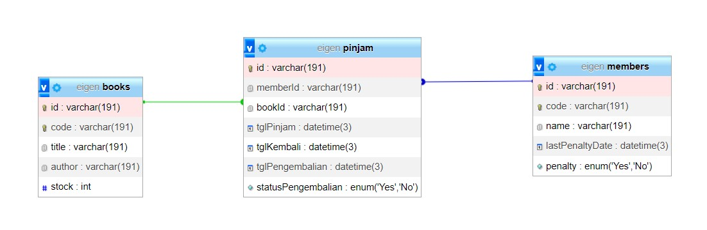

## 🛠️ Tech Stack

The solutions primarily leverage the following technologies:

-   **Language:** [JavaScript](https://developer.mozilla.org/en-US/docs/Web/JavaScript) (Node.js environment)
-   **ORM:** [Prisma](https://www.prisma.io/)
-   **Testing:** (Specify if you use a testing framework, e.g., Jest, Mocha)

## 🚀 Getting Started

To explore the solutions, follow these simple steps.

1.  **Clone the repository:**
    ```bash
    git clone [this project repository URL]
    cd nvx-eigen-test
    ```

2.  **Install Dependencies:**
    Navigate to the `app` directory and install the required packages.
    ```bash
    cd app
    npm install 
    ```

3.  **Setup Prisma & Database:**
    Initialize Prisma, migrate the database, and generate the Prisma client.
    ```bash
    npx prisma init 
    npx prisma migrate dev
    npx prisma generate
    ```

4.  **Run the Project:**
    Start the application or run the tests.
    ```bash
    npm run dev  # Start the application
    npm run test  # Run tests (21 tests passing)
    ```

## 📖 API Documentation in Swagger

### Available Endpoints

-   `GET /data`: Generate mock data for testing.
-   `GET /api-docs`: View API documentation with Swagger UI.
-   `GET /buku`: Get a list of all available books.
-   `GET /member`: Get a list of all members.
-   `POST /pinjam`: Borrow a book.
-   `POST /pengembalian`: Return a book.

### Database Schema

