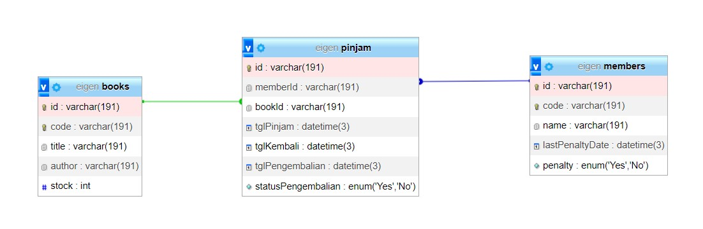

### Install Library

```azure
npm install 
```

### Generate Prisma

```
npx prisma init schema prisma
npx prisma migrate dev migrasi database
npx prisma generate generate prisma client
```

### Run Project

```azure
npm run dev menjalankan program
npm run test menjalankan test dengan 21 pass test
```

### Rest API

```
GET /:Endpoint api
GET /data : Generate mocks data
GET /api-docs :Documentation Swagger UI 
GET /buku : Check all books
GET /member :Check all member
POST /pinjam : Pinjam buku
POST /pengembalian : Pengembalian Buku
```

### Gambar skema database

